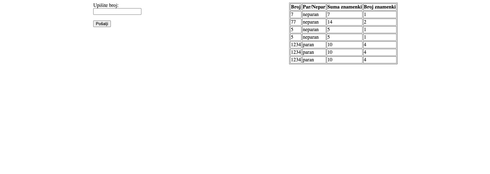

# PHP osnove – parcijalni ispit

Potrebno je izraditi jednostavnu PHP aplikaciju koja omogućuje unos cijelog broja, vrši analizu unesenog broja i rezultate prikazuje u tablici. Podaci se spremaju u datoteku `numbers.json`. Ta datoteka sadrži primjer strukture podataka koju trebate pratiti u svom rješenju.

---

### 🧾 Zahtjevi aplikacije

1. **Forma za unos broja**:
   - S lijeve strane prikazati obrazac s jednim input poljem za unos cijelog broja i gumbom za slanje.

2. **Validacija unosa**:
   - Polje ne smije biti prazno.
   - Mora biti unesen cijeli broj (input mora biti tipa number).

3. **Analiza broja**:
   - Odrediti je li broj **paran** ili **neparan**.
   - Izračunati **suma svih znamenki** broja.
   - Izračunati **broj znamenki**.

4. **Spremanje rezultata**:
   - Svaki valjan unos spremiti u `numbers.json` u obliku asocijativnog niza s podacima:
     - `"broj"`: uneseni broj
     - `"parnost"`: `"paran"` ili `"neparan"`
     - `"suma"`: suma znamenki
     - `"znamenke"`: broj znamenki

5. **Prikaz rezultata**:
   - U desnom dijelu stranice prikazati HTML tablicu s podacima iz `numbers.json`.
   - Tablica sadrži sljedeće stupce:
     - **Broj**
     - **Par/Nepar**
     - **Suma znamenki**
     - **Broj znamenki**

---

### 💡 Napomena

- Za analizu broja i izračune koristite vlastite funkcije.
- Koristite `file_get_contents()` i `file_put_contents()` za rad s JSON datotekom.
- Svaki novi unos se dodaje u postojeću listu.
- Pretvorba tipova podataka (ako vam bude potrebna) vrši se uporabom (string), (int) i sličnih type casting operatora.
   - primjer pretvorbe: `echo (int)"123"` ***ispisuje 123***
- ako želite iz stringa dobiti array, koristite `str_split` ili neku sličnu funkciju
- za zbroj znamenki možete istražiti postoji li funkcija koja sumira članove niza

---

### 🎨 Izgled aplikacije

---

### 🆕 Kako riješiti ispit?

1. Pozicionirajte se u terminalu tamo gdje želite klonirati ovaj repo i iskoristite `git clone` naredbu
2. napravite svoj branch
3. riješite zadatke
4. pushajte svoj branch na github
5. napravite Pull Request (PR)
6. opustite se i u miru očekujte rezultate
7. dok odmarate riješite anketu 😊
---

Sretno! ✅
